# Laporan Praktikum Jaringan Komputer Modul 1 D14 2023

Penulis:
- Darren Prasetya (5025211162)
- 
## Soal 6
Seorang anak bernama Udin Berteman dengan SlameT yang merupakan seorang penggemar film detektif. sebagai teman yang baik, Ia selalu mengajak slamet untuk bermain valoranT bersama. suatu malam, terjadi sebuah hal yang tak terdUga. ketika udin mereka membuka game tersebut, laptop udin menunjukkan sebuah field text dan Sebuah kode Invalid bertuliskan "server SOURCE ADDRESS 7812 is invalid". ketika ditelusuri di google, hasil pencarian hanya menampilkan a1 e5 u21. jiwa detektif slamet pun bergejolak. bantulah udin dan slamet untuk menemukan solusi kode error tersebut.

### Steps:
1. Jika kita mengumpulkan setiap huruf kapital dalam paragraf maka kita akan menemukan kata "SUBSTITUSI"
2. Dari hasil pencarian google, kita mengetahui bahwa susbtitusi nya menggunakan a1z26 cipher karena a = 1, e = 5, u = 21.
3. Dari error message "server SOURCE ADDRESS 7812 is invalid", kita dapat menyimpulkan bahwa paket yang perlu di perhatikan adalah paket ke-7812 and source ip address-nya.
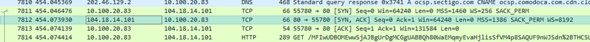
4. Source ip address nya adalah "104.18.14.101" dan jika kita sesuaikan dengan constraints menurut clue yaitu 1-18 maka formatnya menjadi "10-4-18-14-10-1"
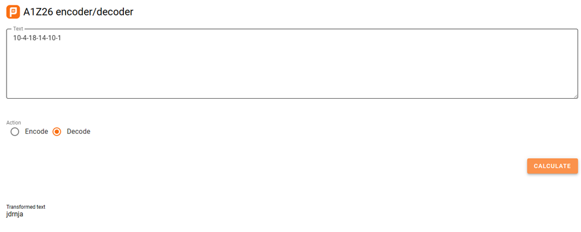
5. Jika kita masukkan ip tersebut dalam cipher, kita akan mendapatkan "jdrnja" dan menurut hint, hurufnya kapital (JDRNJA).

### Submission
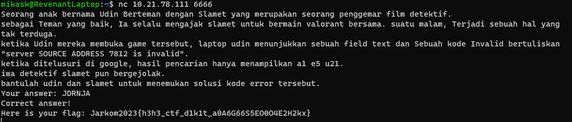

## Soal 7
Berapa jumlah packet yang menuju IP 184.87.193.88?

### Steps:
1. Pertama, kita menggunakan display filter: ip.dst == 184.87.193.88
2. Jika kita hitung jumlah paket yang keluar dari filternya, terdapat 6 paket.

### Submission:
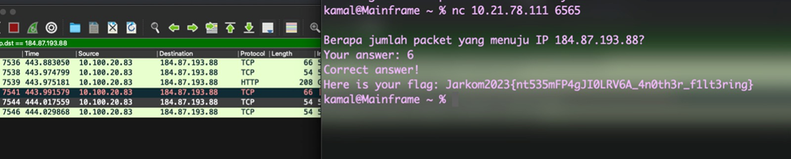

## Soal 8
Berikan kueri filter sehingga wireshark hanya mengambil semua protokol paket yang menuju port 80! (Jika terdapat lebih dari 1 port, maka urutkan sesuai dengan abjad)

### Steps:
1. Untuk mendapatkan semua protokol yang menuju port 80, kita perlu identifikasi protokol yang menggunakan port yaitu UDP dan TCP
2. Kemudian, karena kita hanya memerlukan paket yang MENUJU port 80, maka kita dapat menggunakan dstport.
3. Query filter: tcp.dstport == 80 || udp.dstport == 80

### Submission:
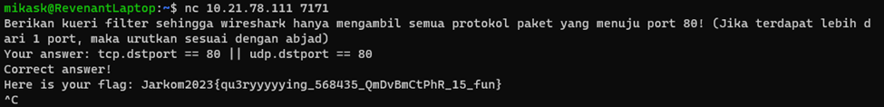

## Soal 9
Berikan kueri filter sehingga wireshark hanya mengambil paket yang berasal dari alamat 10.51.40.1 tetapi tidak menuju ke alamat 10.39.55.34!

### Steps:
1. Untuk mendapatkan paket yang berasal dari sebuah alamat ktia bisa memakai ip.src dan untuk mendapatkan paket yang menuju alamat tertentu kita bisa memakai ip.dst.
2. Sehingga, query filter: ip.src == 10.51.40.1 && ip.dst != 10.39.55.34

### Submission
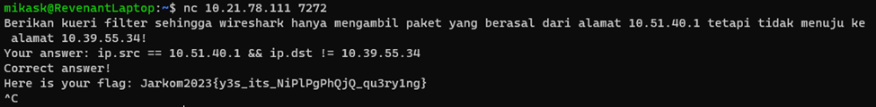

## Soal 10
Sebutkan kredensial yang benar ketika user mencoba login menggunakan Telnet

### Steps:
1. Untuk mencari paket yang memakai telnet
2. Kemudian, kita tinggal analisis secara manual
3. Ada paket yang memiliki data “Login” kemudian tiap huruf dari username itu berbeda paket.
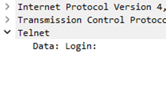
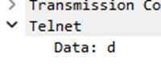
4. Username: dhafin
5. Untuk passwordnya terdapat dalam satu paket setelah paket yang memiliki data “Password:”
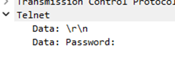
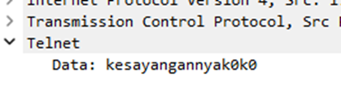
6. Berarti jawabannya dhafin:kesayangannyak0k0 sesuai 

### Submission:
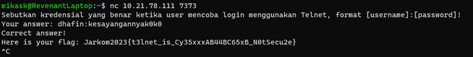